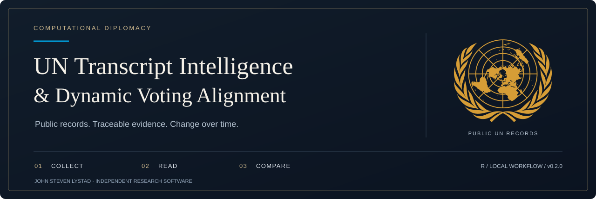
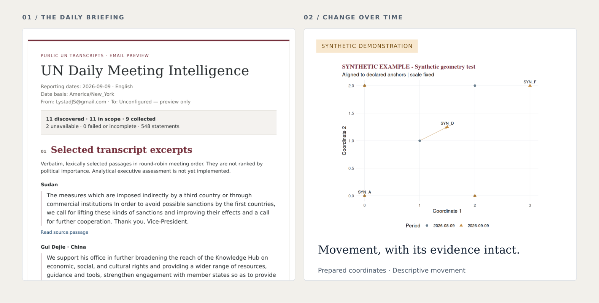

<p align="center">
  
</p>

<p align="center">
  <strong>R 4.3+</strong> &nbsp; · &nbsp; <strong>Windows 11 target</strong> &nbsp; · &nbsp; <strong>DuckDB + Parquet</strong> &nbsp; · &nbsp; <strong>v0.2.0 preview</strong>
</p>

<p align="center">
  <a href="#overview">Overview</a> &nbsp; / &nbsp;
  <a href="#in-the-briefing">Preview</a> &nbsp; / &nbsp;
  <a href="#quick-start">Quick start</a> &nbsp; / &nbsp;
  <a href="#research-roadmap">Roadmap</a> &nbsp; / &nbsp;
  <a href="docs/USER_GUIDE.md">User guide</a>
</p>

---

## Overview

**Follow what delegations say. Preserve the evidence. Study how alignment changes.**

An R-based research workflow that turns public UN meeting transcripts into traceable briefings and connects prepared position maps to longitudinal analysis. Built to run on a personal computer, with configurable topic screens and a complete local evidence archive.

<table>
<tr>
<td width="33%" valign="top">
<h3>01 · Collect</h3>
<p>Discover meetings, retrieve available transcripts, and retain source versions with SHA-256 hashes.</p>
<p><a href="R/02_collect.R">Collection pipeline →</a></p>
</td>
<td width="33%" valign="top">
<h3>02 · Read</h3>
<p>Build concise briefings from verbatim passages, with evidence IDs, source links, and coverage accounting.</p>
<p><a href="docs/USER_GUIDE.md#method-and-interpretation">Extractive method →</a></p>
</td>
<td width="33%" valign="top">
<h3>03 · Compare</h3>
<p>Align prepared coordinate snapshots with driftmapR and visualize movement across observed periods.</p>
<p><a href="docs/DRIFTMAPR_ADAPTER.md">Adapter contract →</a></p>
</td>
</tr>
</table>

> **Current release:** collection, extractive summaries, local email previews, and a descriptive driftmapR adapter. Automated email delivery and substantive opinion/voting models remain future work.

## In the briefing

<a href="examples/email-preview.html">
  
</a>

<sub>Left: a rendered excerpt of the included archived-transcript briefing. Right: the actual adapter's <strong>synthetic engineering fixture</strong>; these points are not country positions.</sub>

The six-section report combines selected excerpts, a U.S. Mission relevance section, cross-meeting developments, compact meeting cards, separate statement/voting panels, and full coverage. Relevance and cross-meeting synthesis are explicitly marked unassessed in this extractive release.

**Explore the examples:** [Briefing HTML](examples/email-preview.html) · [Synthetic map](examples/drift-demo/model-assets/statements/movement.png) · [Email MIME file](examples/drift-demo/email-preview.eml) · [Full report](examples/full-report.html)

<sub>GitHub displays HTML as source. Download the repository and open these HTML files locally to view the complete layouts.</sub>

## Quick start

**Install [64-bit R](https://cran.r-project.org/bin/windows/base/) and [RStudio Desktop](https://posit.co/download/rstudio-desktop/), then [download the repository](https://github.com/LystadJS/UN-Transcript-Intelligence-Dynamic-Voting-Alignment/archive/refs/heads/main.zip).** Extract it, open `UN_Transcript_R.Rproj`, and run in the RStudio Console:

```r
source("setup.R")
source("setup_driftmapR.R")
source("tests/run_tests.R")
source("demo.R")
source("demo_drift.R")
```

After dependencies are installed, the demos replay the included archive without new UN requests. The drift demo adds a clearly labeled synthetic movement map. Successful demos open a local preview.

**Application runtime:** entirely R; no Python, GPU, language-model API, or email credentials required. Live collection needs internet access. Windows setup and received Gmail rendering still require local acceptance testing.

<details>
<summary><strong>Collect a live date or run the default lookback</strong></summary>

```r
source("run.R")

# One explicit date within the source's available inventory
result <- run_cli(c("--date", "2026-09-09"))
browseURL(result$preview)

# Default: previous three calendar days in New York
result <- run_cli(character())
browseURL(result$preview)
```

Edit [`config/settings.yml`](config/settings.yml) to set collection scope, preview fields, and model artifact paths. Empty topic/category lists retain all available topics/categories; [optional topic screens](config/topics-example.yml) use regular expressions. The current source inventory has a rolling 365-day window.

</details>

## Evidence you can inspect

| Layer | What the release retains |
| :--- | :--- |
| **Sources** | Raw responses, SHA-256 hashes, source URLs, and collection timestamps |
| **Summaries** | Verbatim passages with contiguous sentence indices and statement → meeting → daily lineage |
| **Coverage** | Unavailable transcripts, unresolved affiliations, source warnings, and explicit run status |
| **Model artifacts** | Frozen inputs, alignment outputs, movement tables, figures, and per-track status |
| **Reproduction** | Run manifests, dependency versions, CSV/JSON exports, DuckDB, and optional Parquet |

**Recorded 0.2.0 validation:** 26 passing engineering test groups; an archived replay with 11 inventory entries, 9 transcripts, 548 statements, and 5,327 evidence sentences. These are development results on Linux, not Windows certification or scientific validation of opinion measurement. [Read the validation record →](docs/VALIDATION.md)

## Research roadmap

| Component | Status | Boundary |
| :--- | :--- | :--- |
| Transcript collection & archive | **Implemented** | English transcripts; explicit missing-source accounting |
| Extractive briefing & email preview | **Implemented** | Source quotations; no generated policy assessment |
| driftmapR visualization adapter | **Implemented** | Prepared 2D coordinates; descriptive movement only |
| Windows installation & scheduling | **Acceptance pending** | Setup and scheduling instructions supplied |
| Transcript-based position measurement | **Planned** | Must establish and validate the upstream measurement model |
| Dynamic voting alignment model | **Planned** | A separate voting panel exists; voting-model estimation does not |
| Gmail delivery | **Planned** | Current output is preview-only; no message is sent |

<details>
<summary><strong>How driftmapR fits the research design</strong></summary>

The adapter consumes country/entity IDs, dated coordinate snapshots, evidence references, and a measurement specification. It uses the bundled **driftmapR 0.0.5.9000** prototype to align snapshots, calculate adjacent-period displacement, and optionally measure changes in distance to a reference entity.

Statement and voting artifacts remain separate tracks. Missing observations are not bridged, synthetic inputs require explicit opt-in, and stale or failed artifacts are labeled. The adapter does not infer opinions from raw text, estimate uncertainty, or turn geometric proximity into evidence of political support.

See the [input schema and interpretation limits](docs/DRIFTMAPR_ADAPTER.md) and [implementation](R/07_drift_adapter.R).

</details>

## Project desk

| Start here | Reference |
| :--- | :--- |
| Install, configure, schedule, troubleshoot | [User guide](docs/USER_GUIDE.md) |
| Prepare statement or voting coordinates | [driftmapR adapter](docs/DRIFTMAPR_ADAPTER.md) |
| Inspect checks and remaining limits | [Validation record](docs/VALIDATION.md) |
| Review the briefing design | [Design specification](docs/BRIEFING_DESIGN_2026-09-21.md) |
| Explore the R implementation | [Source](R/) · [Tests](tests/) · [Examples](examples/) |
| Understand source coverage | [UN API guide](https://transcripts.un.org/llms.txt) · [Transcript limitations](https://transcripts.un.org/en/about) |

---

<p align="center">
  <strong>John Steven Lystad</strong><br />
  <a href="https://lystadjs.github.io/">Portfolio</a> &nbsp; · &nbsp;
  <a href="https://github.com/LystadJS">GitHub</a> &nbsp; · &nbsp;
  <a href="docs/assets/README.md">Visual credits</a>
</p>

<p align="center">
  <sub>Independent research software. Not an official product of the United Nations, U.S. Mission to the UN, or U.S. Department of State. The UN emblem identifies the subject of the research; it does not indicate endorsement.</sub>
</p>
